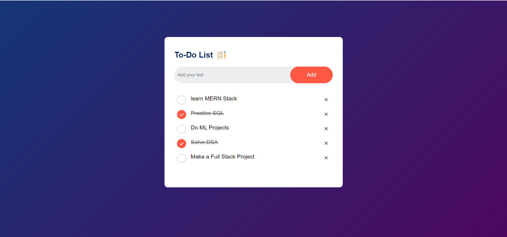

# To-Do List

A simple to-do list website that helps you keep track of tasks and stay organized.

## Demo

You can check out a live demo of the to-do list website [here](#).



## Features

- Add, edit, and delete tasks.
- Mark tasks as completed.
- Simple and intuitive user interface.
- Data persistence using local storage.

## Technologies Used

- HTML
- CSS
- JavaScript

## Getting Started

To get a copy of this project up and running on your local machine, follow these steps:

1. Clone the repository:

   ```bash
   git clone https://github.com/your-username/todo-list.git
